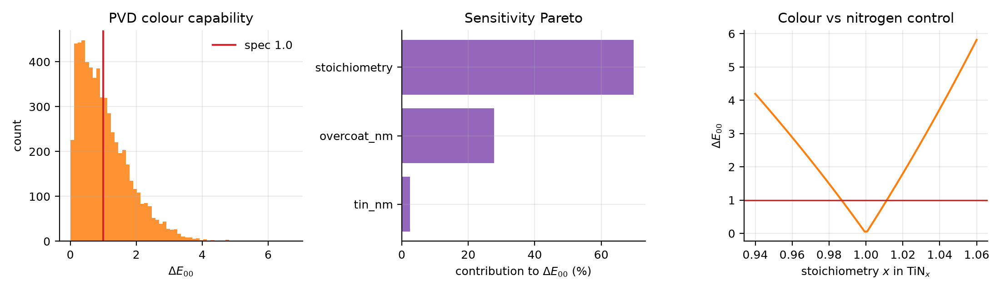
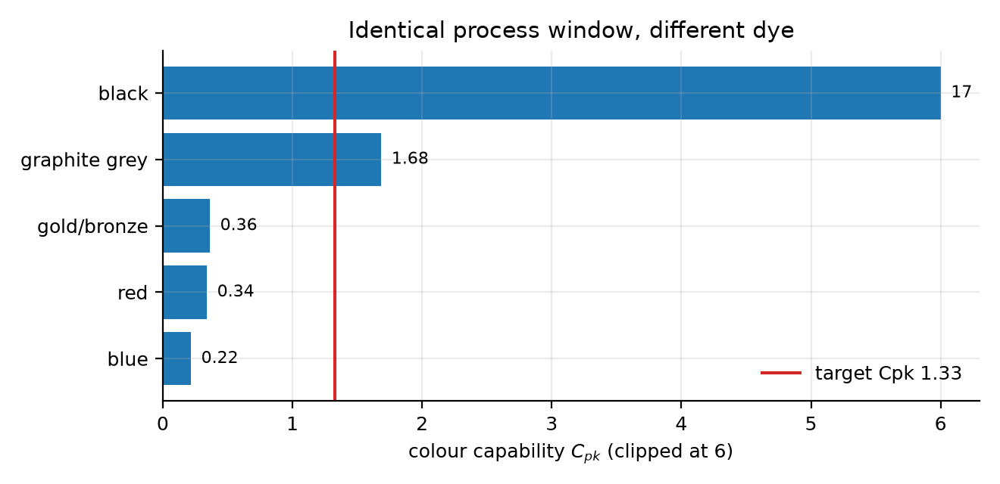

# Cosmetic Finish Process-Capability Simulator

[](https://cosmetic-finish-capability.streamlit.app)
[](https://github.com/Jnanadyuti-Patra/cosmetic-finish-capability/actions/workflows/tests.yml)
[](https://www.python.org/)
[](LICENSE)

Predicting **colour yield** from **process control limits**, for two industrial
surface-finishing routes.

### ▶ [Try the live dashboard](https://cosmetic-finish-capability.streamlit.app)

Move the process settings and the control tolerances, and watch the predicted
colour, the capability index and the yield move with them. No install required.

A finished aluminium or stainless enclosure has to come out the same colour every
time. Both common routes to that colour, anodize-and-dye and PVD thin film,
end in a spectrum that must sit inside a tight colour tolerance. This project
asks the question a finishing engineer is actually paid to answer:

> Given how tightly my line holds bath temperature, current density and nitrogen
> flow, what fraction of parts land inside the colour spec, and which knob do I
> tighten first?

One pipeline answers it for both routes:

```
process variation  ->  physics  ->  R(lambda)  ->  CIELAB  ->  dE00  ->  Cpk  ->  yield
```



*A PVD interference stack at realistic production tolerances. Much of the
distribution (left) sits beyond the colour specification. Nitrogen
stoichiometry dominates the Pareto (centre), and the colour penalty against
nitrogen control (right) is steeply quadratic, so drift in either direction is
punished.*

---

## Headline results

Run `python scripts/run_study.py` to regenerate every number below.

**1. The PVD interference stack fails at realistic tolerances.**

| | value |
|---|---|
| Stack | air / SiO2 90 nm / TiN 300 nm / Ti 80 nm / SS304 |
| Yield against dE00 < 1.0 | **56.4 %** |
| Colour Cpk | **-0.018** |
| Share of colour variance from TiN stoichiometry alone | **69.8 %** |

**2. Solving for the tolerance that would hold Cpk >= 1.33:**

| control | current | required | factor |
|---|---|---|---|
| TiN stoichiometry (nitrogen flow) | ±0.040 | **±0.0067** | 6.0x tighter |
| SiO2 overcoat thickness | ±8.0 nm | **±3.0 nm** | 2.7x tighter |
| TiN thickness | ±20 nm | ±20 nm | unchanged (irrelevant) |

TiN thickness does not matter because the film is optically opaque past roughly
150 nm. Thickness is the intuitive knob and it is the wrong one; composition is
the real one.

**3. The colour a designer picks is itself a capability decision.**

Identical anodizing process window, identical tolerances, different dye:

| dye | colour Cpk | yield |
|---|---|---|
| black | 16.68 | 100.00 % |
| graphite grey | 1.68 | 99.96 % |
| gold/bronze | 0.36 | 85.20 % |
| red | 0.34 | 84.24 % |
| blue | 0.22 | 77.72 % |



A saturated black sits deep in Beer-Lambert saturation, so dye-bath noise barely
moves it. Pale and chromatic finishes sit on the steep part of the curve. Yield
swings **22 points** with no process change at all. The decision was made in the
design review, not on the line.

**4. The two routes fail in completely different places.** Anodized black is
colour-robust (Cpk 16.7) and limited by *film thickness* (Cpk 1.80). The PVD
stack has no thickness problem and is limited entirely by *composition*. A
control plan written for one is close to useless for the other.

---

## Install and run

```bash
python -m pip install -e ".[all]"
```

Windows, from a clean checkout:

```bash
setup_windows.bat
```

Then:

```bash
python scripts/run_study.py      # regenerate all results and figures
python -m pytest                 # 62 tests
streamlit run streamlit_app.py   # interactive dashboard
```

`run_local.bat` (or `run_local.sh`) launches the dashboard directly.

---

## What is inside

```
finishsim/
  colourimetry.py   spectral -> CIE XYZ -> CIELAB -> CIEDE2000
  materials.py      n(lambda) + i k(lambda), Drude-Lorentz and Sellmeier
  pvd.py            thin-film stack reflectance, transfer-matrix method
  anodize.py        Type II sulfuric anodizing kinetics + dye uptake
  capability.py     Monte-Carlo variation, Cpk, yield, sensitivity ranking
  doe.py            Box-Behnken designs, response surfaces, JMP export
scripts/run_study.py   reproduces every figure and number in the report
streamlit_app.py       interactive dashboard
docs/report.tex        full technical report, written for a non-specialist
tests/                 62 tests including published reference values
data/                  drop measured n,k CSVs here to override the models
```

### The physics, briefly

**Anodizing.** Oxide grows by Faraday's law from the anodizing current and is
simultaneously eaten back by the acid:

```
dx/dt = M_ox * j * eta / (z F rho_ox)  -  k0 exp(-Ea/RT) [H2SO4]^m
```

The back-dissolution term is Arrhenius, so it roughly doubles per +10 °C. That
single coupling is why bath temperature is the dominant cosmetic lever: a warm
bath both thins the film and opens the pores, and the part comes out lighter and
duller. The nominal recipe (1.5 A/dm², 30 min, 20 °C, 180 g/L) returns 9.66 µm,
against the ~10 µm Type II spec. That agreement is the model's calibration
anchor and is enforced by a test.

**PVD.** Each layer contributes a characteristic matrix; the assembled product
maps substrate admittance to the front surface and gives the amplitude
reflection coefficient. This is the calculation Essential Macleod and TFCALC
perform. Colour then follows from R(lambda) through the standard CIE chain.

**Colour.** Reflectance is weighted by the D65 illuminant and the CIE 1931
2-degree observer to give XYZ, converted to CIELAB, and compared to the approved
master by CIEDE2000.

### Verification

- All **13** CIEDE2000 reference pairs from Sharma, Wu & Dalal (2005) reproduce
  to within 1e-4.
- The perfect reflecting diffuser returns exactly L\* = 100, a\* = b\* = 0, and
  the D65 white point matches the CIE values (95.047, 100, 108.883).
- Reflectance stays in [0, 1] for every stack at every angle. This is the check
  that catches the n+ik vs n−ik convention error, which otherwise fails silently by
  turning absorbing layers into gain media.
- The response-surface fitter recovers a known quadratic exactly (R² = 1).
- Anodizing back-dissolution is verified to roughly double per 10 °C.

### Honest limits

- **Optical constants are representative literature fits, not measurements of a
  specific supplier's coating.** They reproduce the correct colour family and
  dispersion shape, which is what a *sensitivity* study needs. The conclusions
  concern how strongly colour responds to process variation, governed by stack
  geometry and the shape of n(lambda). For absolute colour prediction against a
  real master, drop measured n,k into `data/`; see `data/README.md`.
- The dye-uptake and porosity relations are phenomenological, fitted to
  published Type II behaviour rather than derived from first principles.
- Capability computed from samples at fixed nominal settings is **short-term,
  within-batch**. Real long-term Ppk will be worse, because it also carries
  drift between bath changes, rack position and operator.
- No experimental validation. Every number here is simulation. Coupon trials
  would be the natural next step, and the code is structured so a measured
  dataset drops straight in.

---

## JMP

`scripts/run_study.py` writes a JMP-ready design table and a `.jsl` script to
`outputs/`. Open the `.jsl` in JMP and run it (Ctrl+R) to get the Fit Model
platform, prediction profiler and contour profiler with the quadratic response
surface already specified.

## References

- Sheasby, P. G. & Pinner, R. *The Surface Treatment and Finishing of Aluminium
  and its Alloys*, 6th ed., ASM International / Finishing Publications, 2001.
- Macleod, H. A. *Thin-Film Optical Filters*, 4th ed., CRC Press, 2010.
- Sharma, G., Wu, W. & Dalal, E. N. "The CIEDE2000 colour-difference formula."
  *Color Research & Application* **30**(1), 21–30, 2005.
- Wyman, C., Sloan, P.-P. & Shirley, P. "Simple analytic approximations to the
  CIE XYZ colour matching functions." *JCGT* **2**(2), 1–11, 2013.
- Montgomery, D. C. *Design and Analysis of Experiments*, 10th ed., Wiley, 2019.
- Patsalas, P. & Logothetidis, S. "Optical, electronic and transport properties
  of nanocrystalline titanium nitride thin films." *J. Appl. Phys.* **90**,
  4725, 2001.

## License

MIT. See [LICENSE](LICENSE).
